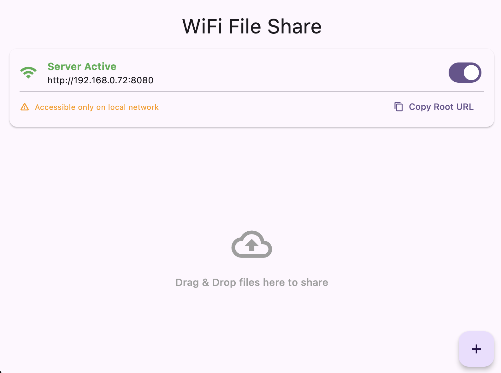

# WiFi File Share

A streamlined Flutter application for **Windows, macOS, iOS, and Android** that allows you to share files instantly over your local WiFi network. No internet connection required—just drag, drop, and share.

## Overview

WiFi File Share turns your device into a local HTTP server, enabling you to share files with any device (phones, tablets, other computers) connected to the same network. It generates a unique link and QR code for each file, making transfer seamless.

## Features

- **🚀 Cross-Platform:** Works seamlessly on Windows, macOS, and Android.
- **📂 Flexible File Selection:**
    - **Desktop:** Drag & Drop support for quick sharing.
    - **Mobile (Android & iOS):** Native file picker integration.
- **📱 QR Code Sharing:** Generate a QR code for any shared file to instantly download it on mobile devices.
- **📺 Media Streaming:** Built-in support for HTTP Range requests allows smooth streaming of video and audio files without downloading them first.
- **🔒 Local Network Only:** Files are shared directly over your local WiFi, ensuring fast speeds and privacy. No data leaves your network.

## Getting Started

### Desktop (Windows & macOS)
1.  **Launch the App:** Open WiFi File Share on your computer.
2.  **Connect to WiFi:** Ensure your computer and the receiving device are connected to the ***same*** WiFi network.
3.  **Share Files:** Drag and drop files or use the "+" button.

### Mobile (Android & iOS)
1.  **Launch the App:** Open the app on your mobile device.
2.  **Permissions:**
    - **iOS:** Allow "Local Network" access (to share) and "Photos" access (to pick files).
    - **Android:** Allow storage permissions.
3.  **Share Files:** Tap the "+" button to select files from your device.

### Accessing Files (Receiver)
1.  **Scan QR Code:** Use a mobile camera or QR scanner.
2.  **Direct Link:** Open the displayed URL (e.g., `http://192.168.1.5:8080/...`) in any web browser.
3.  **Stream or Download:** Watch videos, listen to music, or download files directly.

## How It Works

The application starts a local HTTP server on port 8080 (or the next available port).
- **Media Support:** The server automatically handles MIME types and supports partial content requests (Range headers), making it perfect for watching movies or listening to music directly from the browser.

## Tech Stack

- **Framework:** Flutter (Windows, macOS, iOS & Android)
- **Server:** Dart `dart:io` HttpServer
- **Dependencies:**
    - `desktop_drop` for drag-and-drop (Desktop).
    - `file_picker` for system file picking (Android/Desktop).
    - `qr_flutter` for generating QR codes.
    - `mime` for file type detection.
    - `flutter_riverpod` for state management.
